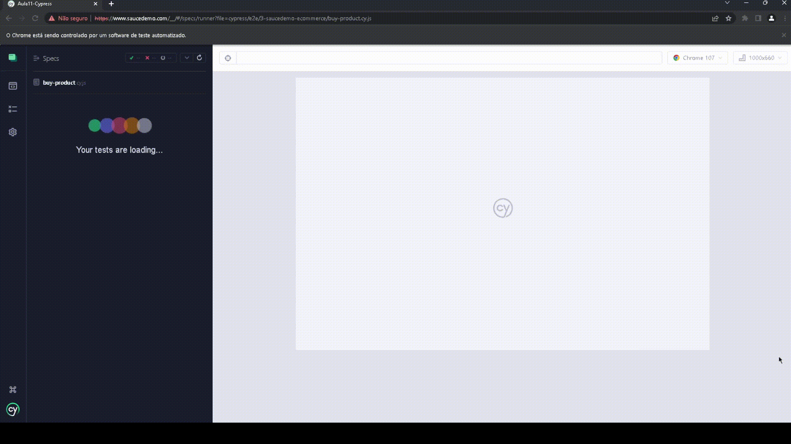
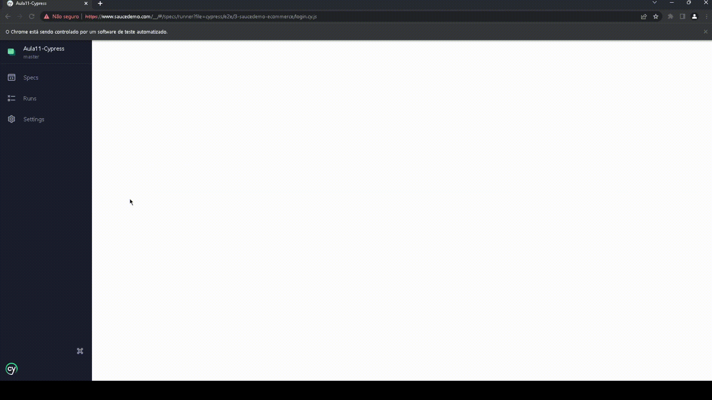

<h1 align="center">
   Cypress
</h1>

 

## 💻 Projeto

O projeto consiste em automatizar os cenários descritos abaixo da aplicação https://www.saucedemo.com/ 

Cenários:
1. Login com sucesso efetuando a compra de um produto e validar a mensagem: "THANK YOU FOR YOUR ORDER"
2. Efetuar Login com sucesso e Login com senha inválida

## :camera: Demonstração

  1. Login com sucesso efetuando a compra de um produto e validar a mensagem: "THANK YOU FOR YOUR ORDER"
    
  

 

  2. Efetuar Login com sucesso e Login com senha inválida
  

## ⚙ Configuração

1- Para instalar as dependências:

Cypress:
> npm install cypress
> 
Faker:
>  yarn add --dev @faker-js/faker
2- Para iniciar a aplicação:

## :rocket: Tecnologias

Esse projeto foi desenvolvido com as seguintes tecnologias:

✔️JavaScript

---
